```
## -- Attaching packages --------------------------------------- tidyverse 1.3.0 --
```

```
## v ggplot2 3.3.3     v purrr   0.3.4
## v tibble  3.1.0     v dplyr   1.0.5
## v tidyr   1.1.3     v stringr 1.4.0
## v readr   1.4.0     v forcats 0.5.1
```

```
## -- Conflicts ------------------------------------------ tidyverse_conflicts() --
## x dplyr::filter() masks stats::filter()
## x dplyr::lag()    masks stats::lag()
```

The data comes from kenpom.com. As the data used in this analysis is part of the Kenpom Subscription, it will not be provided. For subscribers, see the Scripts > Webscrape folder to pull this data. For non-subscribers, $20 per year of access is a steal.

The following charts will analyze the Adjusted Effiency Margin (AdjEM) per Kenpom over the course of the season. Certain teams will be highlighted with the 2021 tournament teams in the background.

The following code pulls the data and merges the daily Kenpom AdjEM with the seed to the 2021 tournament. 


```r
setwd("../..")

# Get data from local project
# Not provided as subscription to Kenpom is needed
{
  kenpom.raw <- read.csv(
    "Data/Kenpom - Daily Data - Season 2021.csv",
    colClasses = c("integer", "character", "character", rep("numeric", 7), "Date")
  )

  seeds.raw <- bind_rows(
    read.csv("Data/cbb.csv"),
    read.csv("Data/cbb21.csv") %>% mutate(YEAR = 2021)
  )
}

#Clean & Transform Data
{
  kenpom <- kenpom.raw %>%
    mutate(
      Year = ifelse(month(Date) > 6, year(Date) + 1, year(Date))
    )

  data <- left_join(
    x = kenpom,
    y = seeds.raw %>% select(YEAR, TEAM, SEED, POSTSEASON),
    by = c("Year" = "YEAR", "Team" = "TEAM")
  ) %>%
    mutate(
      EliteEight = ifelse(Team %in% c("Gonzaga", "USC", "Michigan", "UCLA",
                                      "Baylor", "Arkansas", "Oregon St.", "Houston"),
                          1, 0),
      FinalFour = ifelse(Team %in% c("Gonzaga", "UCLA", "Baylor", "Houston"),
                          1, 0)
    ) %>%
    rename(Seed = SEED, Postseason = POSTSEASON)

}
```


### Final Four

The chart below highlights the AdjEM of the final four over the duration of the season. The histogram along the y-axis is the distribution of AdjEM of tournament teams upon the beginning of the tournament.


```r
#highlighting final 4
  {
    p <- data %>% 
      filter(!is.na(Seed)) %>%
      ggplot() +
      geom_line(
        aes(x = ymd(Date), y = AdjEM, color = Team),
        size = 1
      ) + 
      geom_point(
        data = data %>%
          filter(!is.na(Seed), Date == ymd("2021-03-17")),
        aes(x = Date, y = AdjEM),
        size = 0, color = "gray80"
      ) +
      geom_vline(xintercept = ymd("2021-03-17")) +
      gghighlight(
        max(FinalFour), max_highlight = 4,
        use_direct_label = FALSE
      ) +
      geom_dl(
        aes(
          x = Date, y = AdjEM, color = Team, label = Team
        ),
        method = list(
          dl.trans(x = x + .05),
          "last.bumpup", rot = 0, cex = 1
        ),
        size = .75
      ) +
      ggtitle(
        "2021 Tournament Teams Season-Long Adjusted Efficiency",
        "Final Four"
      ) +
      ylab("Adjusted Efficiency Margin") +
      xlab("") +
      labs(caption = "Data Source: Kenpom.com") +
      scale_x_date(
        limits = c(ymd("2020-12-01"), ymd("2021-4-1"))
      ) +
      theme_bw() +
      theme(
        plot.title = element_text(hjust = .5, size = 18),
        plot.subtitle = element_text(hjust = .5, size = 15),
        axis.title.y = element_text(size = 15)
      ) +
      geom_text(
        aes(x = ymd("2021-3-18"), y = -12.5,
            label = "Start of \nNCAA \nTournament"),
        size = 3, color = "black", hjust = 0
      ) +
      geom_vline(xintercept = ymd("2021-03-1")) +
      geom_text(
        aes(x = ymd("2021-3-2"), y = -12.5,
            label = "Start of \nConference \nTournaments"),
        size = 3, color = "black", hjust = 0
      ) + 
      scale_color_manual(values = c(
        "Baylor" = "#003015",
        "Gonzaga" = "#041E42",
        "UCLA" = "#2D68C4", #F2A900
        "Houston" = "#C8102E" #76232F
        ), guide = FALSE)
    
    p2 <- ggMarginal(
      p, margins = "y",
      type="densigram", size=10
    )
    p2
    
    
  }
```

<!-- -->


### Elite Eight

Here is that same chart expanded to show the Elite Eight teams.


```r
#highlighting elite eight
  {
    p <- data %>%
      filter(!is.na(Seed)) %>%
      ggplot() +
      geom_line(
        aes(x = ymd(Date), y = AdjEM, color = Team),
        size = 1
      ) +
      geom_point(
        data = data %>%
          filter(!is.na(Seed), Date == ymd("2021-03-17")),
        aes(x = Date, y = AdjEM),
        size = 0, color = "gray80"
      ) +
      geom_vline(xintercept = ymd("2021-03-17")) +
      gghighlight(
        max(EliteEight), max_highlight = 8,
        use_direct_label = FALSE
      ) +
      geom_dl(
        aes(
          x = Date, y = AdjEM, color = Team, label = Team
        ),
        method = list(
          dl.trans(x = x + .05),
          "last.bumpup", rot = 0, cex = 1
        ),
        size = .75
      ) +
      ggtitle(
        "2021 Tournament Teams Season-Long Adjusted Efficiency",
        "Elite Eight Teams"
      ) +
      ylab("Adjusted Efficiency Margin") +
      xlab("") +
      labs(caption = "Data Source: Kenpom.com") +
      scale_x_date(
        limits = c(ymd("2020-12-01"), ymd("2021-4-1"))
      ) +
      scale_color_discrete(guide = FALSE) +
      theme_bw() +
      theme(
        plot.title = element_text(hjust = .5, size = 18),
        plot.subtitle = element_text(hjust = .5, size = 15),
        axis.title.y = element_text(size = 15)
      ) +
      geom_text(
        aes(x = ymd("2021-3-18"), y = -12.5,
            label = "Start of \nNCAA \nTournament"),
        size = 3, color = "black", hjust = 0
      ) +
      geom_vline(xintercept = ymd("2021-03-1")) +
      geom_text(
        aes(x = ymd("2021-3-2"), y = -12.5,
            label = "Start of \nConference \nTournaments"),
        size = 3, color = "black", hjust = 0
      )

    p2 <- ggMarginal(
      p, margins = "y",
      type="histogram", size=10
    )
    p2
  }
```

<!-- -->


### By Conference


```r
#highlighting specific conference
  {
    confHighlight.SeasonAdjEM <- function(conf){
      
      p <- data %>% 
        filter(!is.na(Seed)) %>%
        ggplot() +
        geom_line(
          aes(x = ymd(Date), y = AdjEM, color = Team),
          size = 1
        ) + 
        geom_point(
          data = data %>%
            filter(!is.na(Seed), Date == ymd("2021-03-17")),
          aes(x = Date, y = AdjEM),
          size = 0, color = "gray80"
        ) +
        geom_vline(xintercept = ymd("2021-03-17")) +
        gghighlight(
          Conference == conf,
          use_direct_label = FALSE
        ) +
        geom_dl(
          aes(
            x = Date, y = AdjEM, color = Team, label = Team
          ),
          method = list(
            dl.trans(x = x + .05),
            "last.bumpup", rot = 0, cex = 1
          ),
          size = .75
        ) +
        ggtitle(
          "2021 Tournament Teams Season-Long Adjusted Efficiency",
          conf
        ) +
        ylab("Adjusted Efficiency Margin") +
        xlab("") +
        labs(caption = "Data Source: Kenpom.com") +
        scale_x_date(
          limits = c(ymd("2020-12-01"), ymd("2021-4-3"))
        ) +
        scale_color_discrete(guide = FALSE) +
        theme_bw() +
        theme(
          plot.title = element_text(hjust = .5, size = 18),
          plot.subtitle = element_text(hjust = .5, size = 15),
          axis.title.y = element_text(size = 15)
        ) +
        geom_text(
          aes(x = ymd("2021-3-18"), y = -12.5,
              label = "Start of \nNCAA \nTournament"),
          size = 3, color = "black", hjust = 0
        ) +
        geom_vline(xintercept = ymd("2021-03-1")) +
        geom_text(
          aes(x = ymd("2021-3-2"), y = -12.5,
              label = "Start of \nConference \nTournaments"),
          size = 3, color = "black", hjust = 0
        )
      
      p2 <- ggMarginal(
        p, margins = "y",
        type="histogram", size=10
      )
      #p2
      
    }
    
    confs <- data %>% 
      filter(!is.na(Seed), Date == ymd("2021-03-1")) %>% 
      group_by(Conference) %>% 
      count() %>% 
      arrange(desc(n)) %>% 
      select(Conference) %>% 
      pull
    
    plots <- lapply(confs, confHighlight.SeasonAdjEM)
    # for (i in c(1:5)) {
    #   plots[i]
    # }
    
  }
```

And because I can't get the plots to populate from the lapply() or a for loop, here's a poor man's for loop:


```r
i <- 1
plots[i]
```

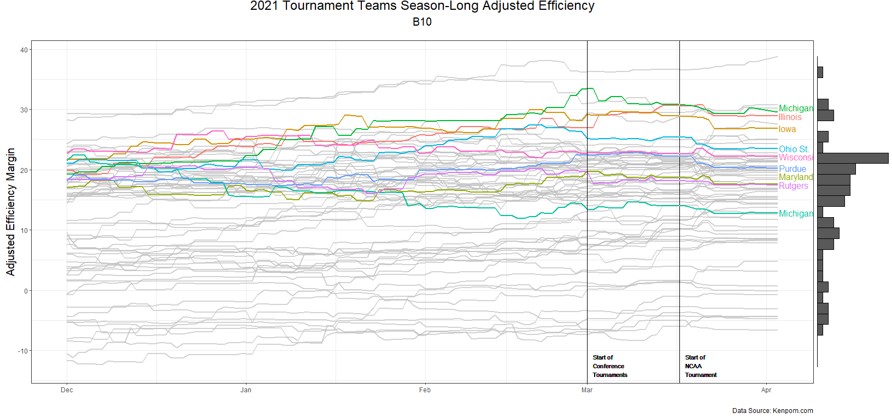<!-- -->

```
## [[1]]
```


```r
i <- i + 1
plots[i]
```

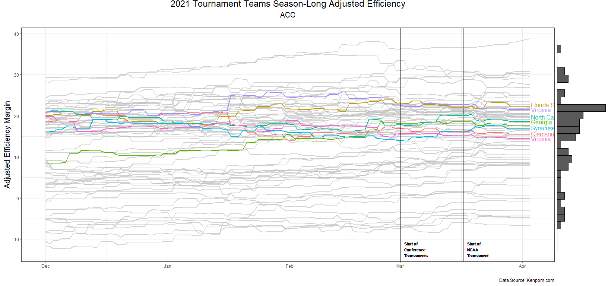<!-- -->

```
## [[1]]
```


```r
i <- i + 1
plots[i]
```

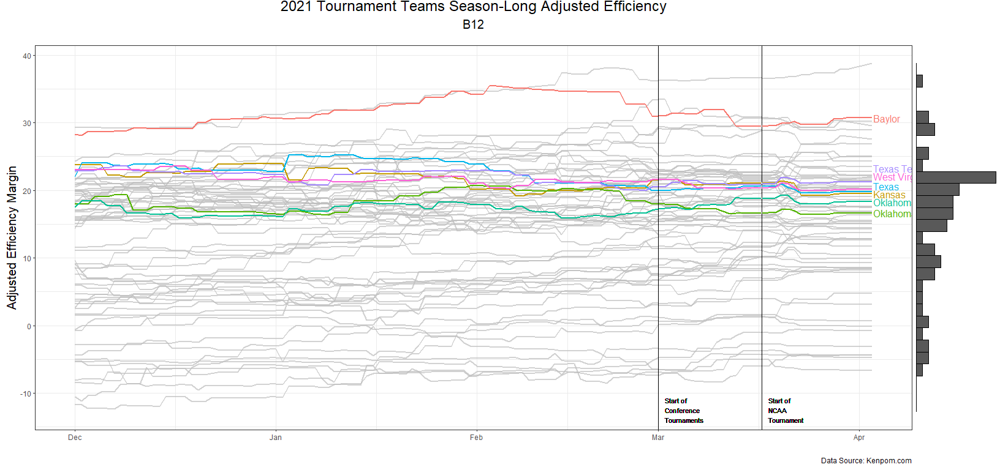<!-- -->

```
## [[1]]
```


```r
i <- i + 1
plots[i]
```

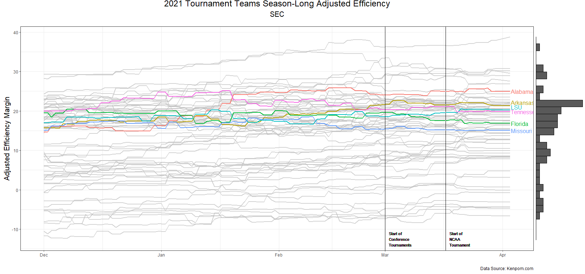<!-- -->

```
## [[1]]
```


```r
i <- i + 1
plots[i]
```

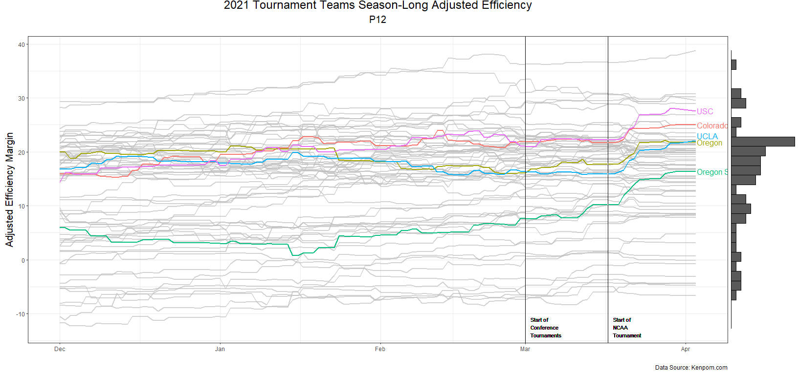<!-- -->

```
## [[1]]
```


```r
i <- i + 1
plots[i]
```

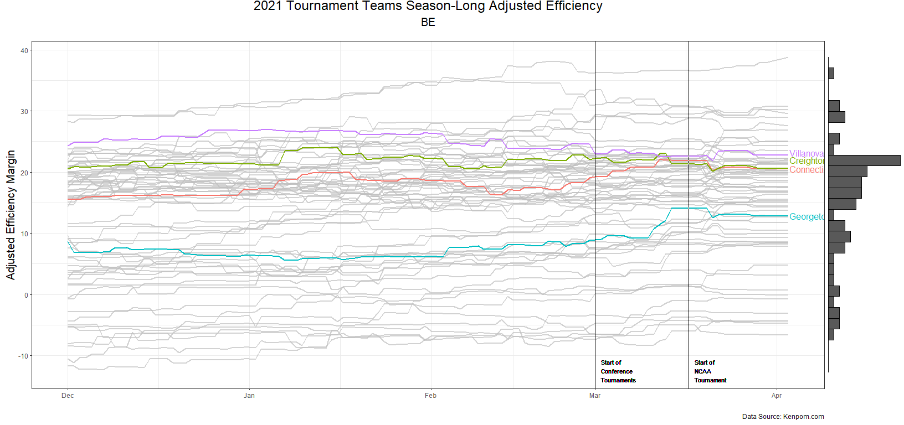<!-- -->

```
## [[1]]
```


```r
i <- i + 1
plots[i]
```

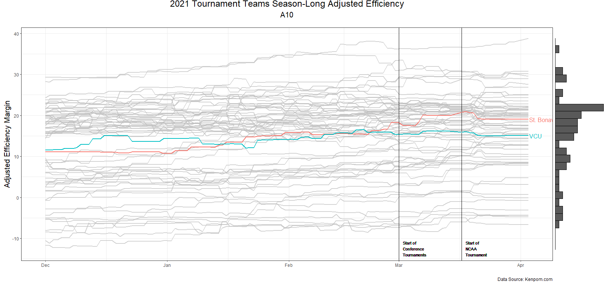<!-- -->

```
## [[1]]
```


```r
i <- i + 1
plots[i]
```

<!-- -->

```
## [[1]]
```


```r
i <- i + 1
plots[i]
```

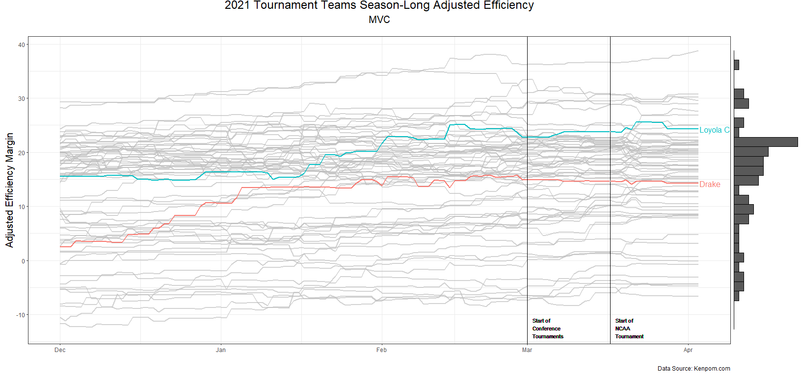<!-- -->

```
## [[1]]
```


```r
i <- i + 1
plots[i]
```

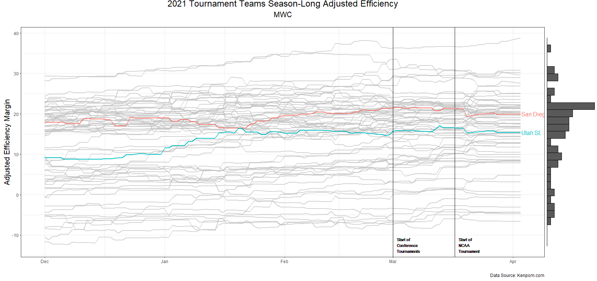<!-- -->

```
## [[1]]
```


```r
i <- i + 1
plots[i]
```

<!-- -->

```
## [[1]]
```


```r
i <- i + 1
plots[i]
```

<!-- -->

```
## [[1]]
```


```r
i <- i + 1
plots[i]
```

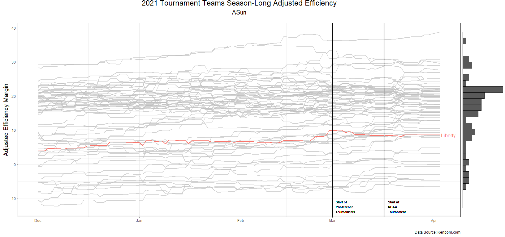<!-- -->

```
## [[1]]
```


```r
i <- i + 1
plots[i]
```

<!-- -->

```
## [[1]]
```


```r
i <- i + 1
plots[i]
```

<!-- -->

```
## [[1]]
```


```r
i <- i + 1
plots[i]
```

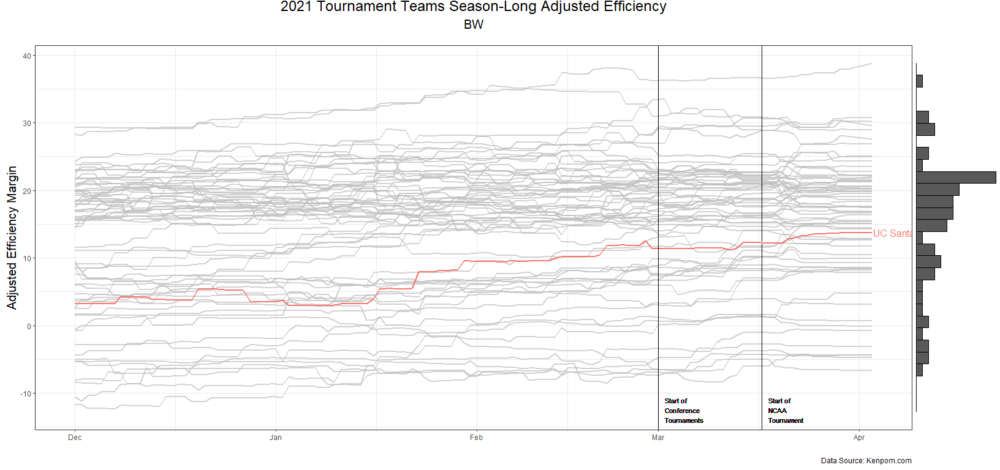<!-- -->

```
## [[1]]
```


```r
i <- i + 1
plots[i]
```

<!-- -->

```
## [[1]]
```


```r
i <- i + 1
plots[i]
```

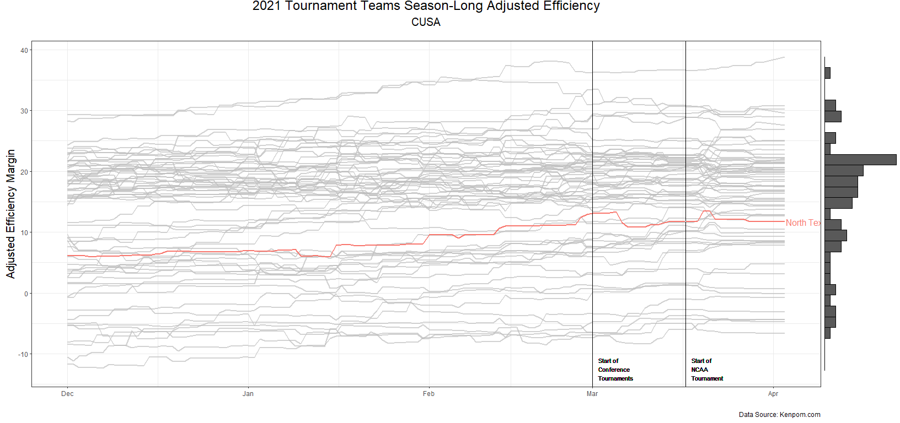<!-- -->

```
## [[1]]
```


```r
i <- i + 1
plots[i]
```

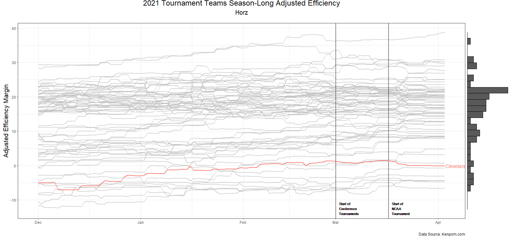<!-- -->

```
## [[1]]
```


```r
i <- i + 1
plots[i]
```

<!-- -->

```
## [[1]]
```


```r
i <- i + 1
plots[i]
```

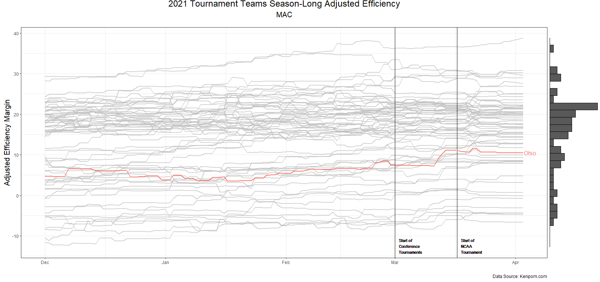<!-- -->

```
## [[1]]
```


```r
i <- i + 1
plots[i]
```

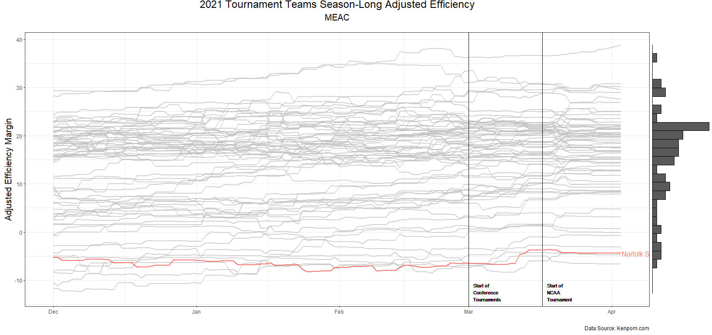<!-- -->

```
## [[1]]
```


```r
i <- i + 1
plots[i]
```

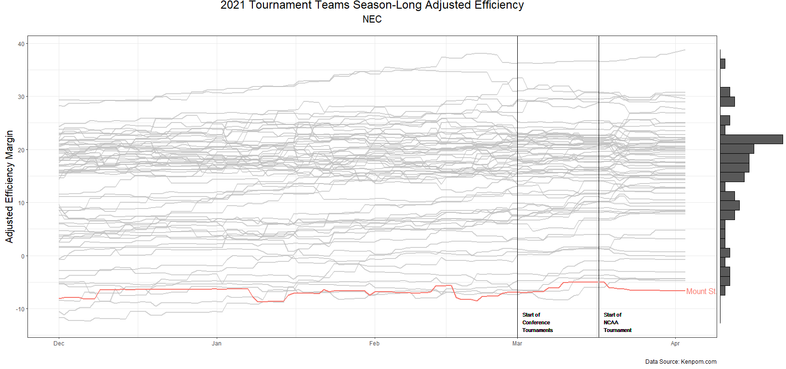<!-- -->

```
## [[1]]
```


```r
i <- i + 1
plots[i]
```

<!-- -->

```
## [[1]]
```


```r
i <- i + 1
plots[i]
```

<!-- -->

```
## [[1]]
```

